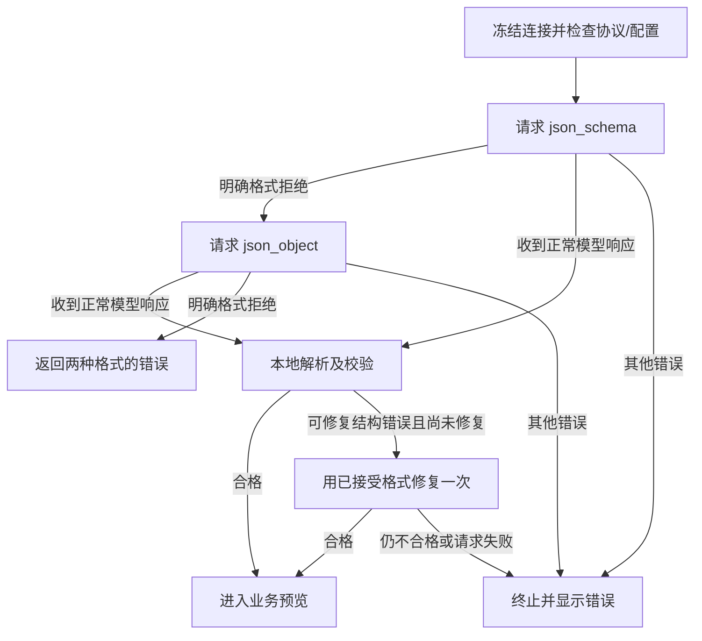

# TauriTavern 结构化 JSON 输出兼容方案

状态：**用户已确认本轮手动测试验收通过，已合并到 `main` 作为后续开发基线。** 核对日期：2026-10-05。实施分支：`fix/tauri-json-compatibility`；当前基线分支：`main`。具体客户端版本和提供商验收矩阵未提供。

此前已撤销 `44c39e4` 的实现及本地 SillyTavern 宿主补丁，回退提交 `5812594` 已推送至 `release/v0.3.2-rc`。本次在回退基线上实施扩展内适配；没有重新修改宿主。运行补丁先提交到 `release/v0.3.2-rc`，手动验收通过后按用户要求合并到 `main`；切换到 `main` 后更新并刷新即可取得修改。

## 1. 交付目标

新机制全部放在扩展仓库内，通过客户端的扩展管理器安装或更新。复用 TauriTavern 已有的前端请求桥接、Rust 请求构造和宿主凭据管理，不修改宿主源码，不增加后端端点，不运行 Node 安装脚本，不要求重新构建 APK。

对已确认使用 OpenAI Chat Completions 协议且宿主可传递格式参数的连接：先请求 `json_schema`；仅在明确拒绝该格式时改用 `json_object`；两种格式都被拒绝时显示两次失败原因。不得自动删除格式参数改用普通输出。

这两种参数不是所有模型提供商的统一协议。原生 Claude Messages、Gemini 和 OpenAI Responses 需要各自的结构化输出适配器，不应将本轮协商算法直接应用到这些协议。

## 2. 已核实的客户端机制

源码核对基于 TauriTavern main 的固定提交 `a1855be4a4f8b6ee7cd0374a84dbb3709c3e5375`。这些是源码证据，尚不构成某个已发布 APK 的实机验收。

| 机制 | 对方案的影响 | 源码证据 |
| --- | --- | --- |
| WebView 拦截 `/api/backends/chat-completions/generate`，调用 Rust `generate_chat_completion` | 扩展调用既有 `fetch` 路径即可经过原生后端，无需浏览器直连提供商 | [ai-routes.js](https://github.com/Darkatse/TauriTavern/blob/a1855be4a4f8b6ee7cd0374a84dbb3709c3e5375/src/tauri/main/routes/ai-routes.js#L704) |
| DTO 使用 `serde(flatten)` 保存请求字段 | 显式顶层 `response_format` 可以进入后端 | [chat_completion_dto.rs](https://github.com/Darkatse/TauriTavern/blob/a1855be4a4f8b6ee7cd0374a84dbb3709c3e5375/src-tauri/crates/tt-application/src/dto/chat_completion_dto.rs#L41) |
| OpenAI 构造器优先使用显式 `response_format`，其次从旧 `json_schema` 生成 | 可以真正切换请求类型，不能靠把旧 `json_schema` 改成空值来声称已请求 JSON object | [openai.rs](https://github.com/Darkatse/TauriTavern/blob/a1855be4a4f8b6ee7cd0374a84dbb3709c3e5375/src-tauri/crates/tt-application/src/services/chat_completion_service/payload/openai.rs#L288) |
| 原生 DeepSeek 路径调用 OpenAI 请求构造器 | DeepSeek 连接也有显式格式参数通路 | [deepseek.rs](https://github.com/Darkatse/TauriTavern/blob/a1855be4a4f8b6ee7cd0374a84dbb3709c3e5375/src-tauri/crates/tt-application/src/services/chat_completion_service/payload/deepseek.rs#L127) |
| 附加请求体在提供商构造之后覆盖字段，并随后删除排除字段 | 必须检查 `custom_include_body`、`custom_exclude_body`；顶层参数不一定是最终发送值 | [additional_parameters.rs](https://github.com/Darkatse/TauriTavern/blob/a1855be4a4f8b6ee7cd0374a84dbb3709c3e5375/src-tauri/crates/tt-application/src/services/chat_completion_service/additional_parameters.rs#L62) |
| `type: "quiet"` 的非流式失败返回 HTTP 502 和 `error`；其他请求可能返回 HTTP 200 的错误助手消息 | 辅助请求必须设置 `type: "quiet"`，并同时检查 HTTP 状态和错误对象 | [ai-routes.js](https://github.com/Darkatse/TauriTavern/blob/a1855be4a4f8b6ee7cd0374a84dbb3709c3e5375/src/tauri/main/routes/ai-routes.js#L735) |
| `ChatCompletionService.sendRequest` 将失败简化成仅有 message 的 Error | 自有传输层应保留桥接层实际提供的错误字段，不继续丢失信息 | [custom-request.js](https://github.com/Darkatse/TauriTavern/blob/a1855be4a4f8b6ee7cd0374a84dbb3709c3e5375/src/scripts/custom-request.js#L462) |
| Connection Manager 支持覆盖请求字段，同时保存 source、model、secret-id、地址、代理及 API format | 可以基于同一配置冻结请求；不能仅凭连接名称判断上游协议 | [shared.js](https://github.com/Darkatse/TauriTavern/blob/a1855be4a4f8b6ee7cd0374a84dbb3709c3e5375/src/scripts/extensions/shared.js#L465) |

[官方架构说明](https://tauritavern.github.io/architecture/overview.html)及[后端说明](https://tauritavern.github.io/architecture/backend.html)用于确认宿主边界。DeepSeek 的 [JSON Output 文档](https://api-docs.deepseek.com/zh-cn/guides/json_mode)要求 `response_format: {"type":"json_object"}`，并在提示词中明确要求 JSON。当前错误 `this response_format type is unavailable now` 应识别为格式类型拒绝，不等同于网络失败。

## 3. 扩展内分层

本地实现新增 `json-host-adapter.js`，修改 `model-protocol.js`，在 `index.js` 接入两者：

| 层 | 职责 |
| --- | --- |
| 宿主适配器 | 读取并冻结连接、识别有效协议、构造请求副本、检查附加参数、调用现有 fetch 桥接、归一化响应与错误 |
| JSON 协议层 | 构造两种格式、格式拒绝分类、有限重试、完整 JSON 解析与结构校验 |
| 业务集成层 | 关幕三项和记忆整理分别调用；维持预览、单项重试、取消、来源与版本检查、批准后保存 |

不引入全局 fetch 替换、临时改主连接、临时改预设或跨请求事件监听。不存在安装器、服务端组件或能力探测端点。普通聊天和非结构化请求保持各自的调用路径。

## 4. 连接快照与宿主适配

### 4.1 独立连接管理器配置

使用上下文公开的 `ConnectionManagerRequestService.getProfile`、`validateProfile` 和 API 映射读取连接，立即克隆配置。按客户端 `sendRequest` 的字段映射构造请求副本：模型、source、secret-id、API format、地址、代理引用及后处理配置必须一致。

代理解析使用客户端 `openai.js` 导出的 `proxies`，保存匹配配置的副本；指定代理找不到时报告配置错误，不悄悄改为直连。仅把宿主已有的代理密码用于本次桥接请求，不记录或持久化它。

维持独立辅助连接不继承生成预设和 instruct 模板的规则。不得把当前主连接的模型、密钥引用、代理或采样参数补进独立连接。附加参数从客户端按 source/API format 管理的配置中读取：使用克隆后的 settings 和 `getAdditionalParametersForSource`，只选取本连接的条目，禁止读取另一个协议的条目。这是新适配器需明确实现并验收的行为；不能假设旧 `includePreset: false` 调用已经携带全部附加参数。

### 4.2 沿用当前聊天连接

读取并克隆 `getContext().chatCompletionSettings`。通过宿主 `openai.js` 导出的 `getChatCompletionModel(snapshot)` 与 `createGenerationParameters(snapshot, model, "quiet", messages, {jsonSchema: null, allowToolCalls: false})` 获取请求基础数据，然后在副本上加本方案的格式参数。

只传入业务已经组装好的辅助提示词，不走整段聊天的主生成流程，不自动引入聊天历史、世界书、角色卡、旧记忆或主预设中的系统提示词。保留本连接的地址、认证引用、代理、必要提供商配置和适用的采样设置。

请求强制非流式、单结果、文本 JSON，关闭工具调用、搜索及图片生成；不继承可能截断 JSON 的 stop strings。必要调整仅发生于本请求副本。构造器中有读取全局停止词、代理校验等实现细节，所以只在任务开始构造一次基础请求，并在异步构造前后核对连接配置未变；变化时中止本次任务，不能宣称所有字段都天然来自 snapshot。

最终请求移除多结果参数 `n`，使用 Chat Completions 默认的单结果，并拒绝多 choice 响应；避免向未在文档中声明 `n` 的 DeepSeek 发送该额外参数。

### 4.3 接口依赖与失效处理

`chatCompletionSettings`、`getRequestHeaders`、连接管理器服务由上下文提供；`createGenerationParameters`、`getChatCompletionModel`、`proxies`、附加参数 helper 是已核实的模块导出，属于需维护版本边界的宿主依赖。使用相对于宿主 scripts 的 ESM 导入，不引入 npm 运行时依赖。

在首次使用时检查所需方法和导出；缺失时返回“当前客户端缺少结构化请求适配接口”，保留预览与手工编辑。不得退回普通输出或访问不存在的端点。运行环境标记只能帮助选择适配器，不能证明 Rust 后端会转发格式参数。

正式发布前记录经过实机验证的 TauriTavern 版本/提交及支持矩阵。当前不指定未经验证的最低 APK 版本；不能以 main 源码验证代替用户安装版验证。旧客户端若缺少所需通路，可升级到经验证的官方版本，无需补丁脚本或自建 APK。

## 5. 有效协议与支持边界

必须同时检查 source、API format、模型路由和实际宿主构造器。`mainApi === "openai"` 只是 Chat Completion 前端类别，`source === "custom"` 也可能对应 Responses、Claude 或 Gemini。

第一阶段支持已核实调用 OpenAI Chat 请求构造器的原生 DeepSeek、Custom `openai_compat` 和 OpenAI Chat 模型。Groq、SiliconFlow 等源码通路可作为后续验收项逐个加入，不能以宽泛的“OpenAI compatible”标签直接放行所有 source。

已核实的特殊路由包括 OpenAI 的 `gpt-6-astra` 使用 Responses，以及旧 text completion 模型使用 `/completions`，两者都不进入本算法。Custom/OpenCode 的 format 必须显式检查；未知 source、未知 format 或无法确定路由时返回协议支持错误，不发送伪结构化请求。

后续原生协议适配器可实现各自的 JSON/schema 参数和响应解析，并共用本地校验及事务层。当前设计不承诺所有提供商都会接受上述两种格式。

## 6. 请求契约与附加参数

每次调用均使用同一冻结连接和基础请求的独立副本：

```js
// 基础字段省略；两次请求均发往已有桥接端点。
{
  type: "quiet",
  stream: false,
  json_schema: null,
  response_format: {
    type: "json_schema",
    json_schema: {
      name: outputSchema.name,
      strict: true,
      schema: outputSchema.value
    }
  }
}

// 仅在明确的格式拒绝后替换为：
response_format: { type: "json_object" }
```

内部旧 schema 的 `value` 要映射成标准 `json_schema.schema`；不得把 `{name, strict, value}` 原样放入上游格式字段。`json_schema: null` 仅清除客户端旧转换/自动解析路径，本身不是 JSON object 请求。

附加参数预检必须模拟客户端 Rust 的合并语义：include 支持 YAML/JSON 对象或对象列表，后项覆盖前项；exclude 支持字符串、数组或对象键。可复用宿主 `lib.js` 导出的 YAML 库，在扩展纯函数层归一化，使用 JSON 字符串序列化结果。解析失败立即报配置错误，不能把原字符串未经检查直接送出。

格式字段采用**请求内归一化**：移除 include 中的 `response_format`、旧 `json_schema`，移除 exclude 中对应键，然后将本次完整 `response_format` 同步放进 include 的最终对象。顶层仍保留显式值。这样 Rust 最后覆盖时也得到相同类型，避免残留 schema 子字段。原设置不改写；预览诊断提示“本次辅助请求已覆盖附加参数中的 JSON 格式配置”。

其他附加参数保持原值。但 include/exclude 若改写或移除连接身份、messages、quiet/stream/单结果约束，或重新加入工具、搜索、图片功能，返回明确的配置冲突；不偷偷删除影响身份或任务语义的配置。模型、地址、认证引用和最终请求类型均纳入预检。

每种格式使用相同的内部输出协议提示词：明确要求只输出一个完整 JSON 对象，列出必需字段/示例，不输出 Markdown。两次调用不更换模型、不改变业务输入。不得读取宿主真实模型 API key 或自行直连提供商；已有 secret-id 和附加认证头仅随桥接请求传递。

## 7. 错误保真与切换条件

传输层直接调用现有端点，使用宿主 `getRequestHeaders()` 和任务的 AbortSignal。先读取响应正文，再尝试解析响应 envelope，保留桥接状态、错误 message/code/category/param（仅在实际存在时）及 cause。provider HTTP status 只有明确携带时才记录，不从桥接 502 推断为上游 502。

该客户端的 `buildLegacyErrorPayload` 当前主要保存 message 和网络分类等信息，并不保证保留上游 status/code/param。因此不能设计成必须取得上游完整错误体；本地传输能减少二次信息丢失，不能还原已被宿主丢掉的信息。

按以下顺序分类：

1. 取消、超时、网络/DNS/TLS/代理错误、认证、权限、额度、限流、服务故障立即终止，不进行格式切换。
2. 明确指向 `response_format.type` 或本次格式不受支持的错误，才切换另一个候选。例如 `this response_format type is unavailable now`、`json_schema is not supported`、格式类型 enum 不包含本次类型。
3. schema 内容错误、字段约束错误、JSON 关键词缺失、token/context 超限、模型不存在、地址错误、笼统的 `validation error` 或 `invalid request` 不视为格式不支持。尤其不能沿用“response_format + invalid”就自动降级的宽泛正则。
4. 没有明确证据的错误直接显示，允许用户修正连接后手工重试。

格式拒绝判据写成独立函数，并对 error/cause 链做有限深度读取。已知网络或认证分类优先于文本匹配，防止错误消息提到 JSON 就触发多收费请求。客户端返回 `error` 时绝不把它交给业务 JSON 解析器。

两种格式都拒绝时呈现：任务名称、连接显示名、模型、两次尝试的格式和脱敏后的错误原因。不得输出完整请求体、认证头、代理密码、带查询凭据的地址或用户原文；诊断只存于本轮任务内存，不进入聊天内容备份。

## 8. 有限状态机与调用预算

初始不缓存提供商能力，每个新的业务项固定先用 `json_schema`。这样模型/网关配置变化不会被旧的能力缓存掩盖。一个业务项或一个整理批次最多三次模型调用：



成功取得正常模型响应后，视为该格式本轮未被 API 拒绝；这不证明提供商严格执行了 schema。输出损坏、截断或缺少字段时，只允许在同一已接受格式下修复一次，不重新进入格式协商。

典型预算：schema 成功 1 次；schema 被拒、object 成功 2 次；两者被拒 2 次；schema 成功但需修复 2 次；schema 被拒、object 返回坏 JSON 并修复 3 次。修复阶段的格式拒绝、网络失败或再次坏 JSON 均终止，无第四次请求。

修复使用相同连接、业务输入及内部格式要求，附上结构错误路径，不附整段失败回答；输出 token 上限最多翻倍，受原有 16,384 上限及已知提供商限制约束。上下文超限仍交给既有整理拆批机制，不由格式协商吞掉。手工单项重试是新任务，重新预检和协商。

## 9. 本地结构和业务校验

两种 API 格式都必须本地验证：协议层完整解析一个 JSON 对象并检查 envelope 的类型、必需字段及数组；业务层验证数组项、枚举、范围和长度。不以合法 JSON 或 HTTP 200 作为业务成功依据。拒绝/refusal、空内容和 tool calls 独立报错，不能把 reasoning 内容当成业务答案。

保留现有日记、角色成长、记忆和维护输出协议。成长 4,000 字符上限、记忆新候选长度及类别等业务约束仍生效，不静默截断，不增加事实真实性或 sources 核验。

记忆提取的 `memories` 与整理的 `operations` 数组继续交给现有业务校验器逐条校验；单条无效候选或建议不触发整个合法 envelope 的格式重试。提取保留有效候选及排除原因；整理保留有效建议及排除原因，仍需用户明确批准部分结果。缺少数组、数组类型错误或 JSON 无法完整解析才进入一次结构修复。

## 10. 事务与移动端行为

任务冻结聊天身份、事务 ID、输入/整库版本及连接指纹。每次发出重试之前和消费响应之后均检查有效性。切聊天、取消、业务输入改变或目标连接配置改变后，不再发出后续请求，不把迟到结果放进当前聊天。

整库版本用于读取旧库的记忆整理任务。关幕提取不读取旧库，因此旧库编辑不使提取失效；批准时继续向最新库追加用户接受的候选，不覆盖期间保存的其他事实。

沿用当前连接时当前连接切换即使旧 payload 已冻结也使任务失效；独立连接任务只因该 profile 或其依赖配置改变而失效，不因无关主连接切换而改走另一模型。持久化仍由现有串行保存与读取核验处理。

格式尝试只更新当前项的进度（例如“记忆提取：json_schema 被拒，尝试 json_object”）。日记、成长或其他整理批次的成功预览不因本项失败丢失。取消调用通过既有 fetch AbortSignal 桥接传至 Rust；Android 后台/恢复后核对事务，不能假定超时等于提供商未执行或未计费。

## 11. 安装与验收计划

实现后只需安装/更新扩展到包含修复的分支，再按客户端要求重新加载扩展或重启应用。稳定版 `main` 与 RC 分支分别说明；更新 main 不会自动取得 RC 提交。移动端不操作 SillyTavern Node 目录，不安装服务端插件。

发布必须补齐以下证据。纯函数、桥接模拟及真实扩展代码配合模拟宿主的验证已执行；真实客户端和提供商项尚未完成：

| 验收 | 通过标准 |
| --- | --- |
| 纯函数及传输模拟 | 两种真实格式对象、精确类型拒绝、其他错误不切换、最大三次、YAML/JSON override 归一化、脱敏与取消 |
| TauriTavern 桌面和 Android 实机 | 经已有桥接/Rust 发出的真实请求含预期 `response_format`；扩展更新即可生效，无宿主修改 |
| DeepSeek 配置 | 使用已配置连接，schema 拒绝后只切换一次 object，得到并验证输出；记录实际客户端版本、source/API format 和模型，不根据连接名称推断 |
| schema 服务及双拒绝服务 | 前者只请求 schema；后者显示两个原因且从不发普通输出请求；故障注入与真实提供商验证分别记录 |
| 独立与当前连接 | endpoint/model/secret-id/proxy 正确；附加参数不覆盖格式；不继承无关连接配置 |
| 非 Chat 协议与旧客户端 | 支持边界明确，不伪装成格式已协商；不足的宿主接口给出可操作错误 |
| 事务与部分成功 | 切聊天、取消、连接改变、迟到返回不串写；成功预览、有效整理建议和部分批准流程保留 |
| 更新与回退 | 移动端从扩展仓库更新、重载后使用新文件；回退仅涉及扩展，无新增数据 schema |

普通 SillyTavern 的 Node 后端不据此宣称支持同样的显式参数通路；需要独立核对其最终请求构造和实机测试。不得再次用宿主补丁脚本替代扩展安装交付。

## 12. 实施顺序

1. 先实现纯函数协商与附加参数归一化，用合成错误和响应验证状态机。
2. 接入 TauriTavern 连接快照和已有 fetch 桥接，验证两条连接入口的实际请求。
3. 复用现有业务解析、逐项容错、预览和事务检查，不改存储 schema。
4. 完成桌面/Android 安装版与提供商验收，记录最低支持版本，再作为扩展内补丁发布。

## 13. 本次 RC 实施记录

- Tauri 环境接入显式两种格式协商；普通 SillyTavern 保留旧的宿主 schema 请求路径及其原有降级行为，未据此声明 Node 后端支持新通路。
- 新增纯函数、桥接模拟和关幕/整理集成测试，覆盖真实 DeepSeek 错误文案、同格式修复、双拒绝、最终覆盖次序、配置冻结、脱敏、取消、迟到返回、部分成功与逐项校验。
- 本地检查：`npm ci --ignore-scripts`、`npm run build` 通过；`npm test` 共 131 项通过、0 失败（包含本轮记忆字段修改的 5 项回归）；`git diff --check` 通过。DeepSeek 文案测试使用合成错误响应，不是本次真实 API 调用。
- 不修改存储 schema、manifest 发行版本或宿主文件。按本轮授权提交并推送 RC 分支，不创建 Release/标签。
- `yaml@2.8.3` 仅作为开发测试依赖，使用 `npm ci` 安装。运行时复用客户端已有 `lib.js` 的 YAML 库；通过扩展管理器安装无需执行 npm。
- 正式版本和 Android 实机的最小支持范围、真实请求转发与提供商行为仍须按第 11 节验收，不能用模拟测试代替。
